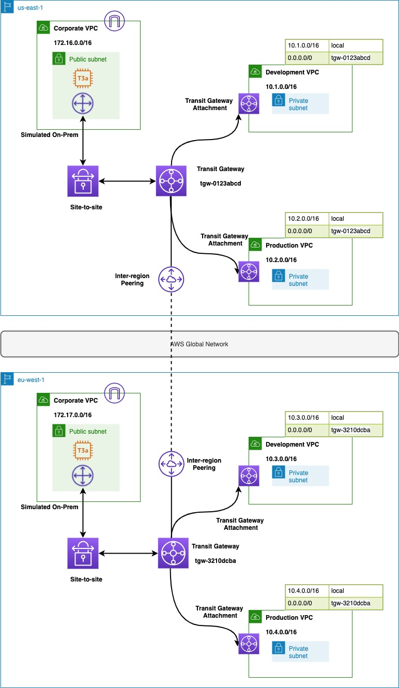

# Network Segmentation using Transit Gateway

## Summary
We will build a global network with development, production and on-prem networks in `us-east-1` and `eu-west-1`. The infrastructure will be built using a combination of CDK, AWS CLI and AWS Console.

Below routes are allowed by this architecture

|     Source    |  Destination  |
|:-------------:|:-------------:|
| DevelopmentUS | DevelopmentEU |
| ProductionUS  | ProductionEU  |
| DevelopmentUS | CorpUS        |
| ProductionUS  | CorpUS        |
| DevelopmentEU | CorpEU        |
| ProductionEU  | CorpEU        |

**Note:** For the on-prem simulation, we will leverage the aws-samples - https://github.com/aws-samples/vpn-gateway-strongwswan

## Architecture



## Install pre-requisites
```
brew install jq
npm i -g -f aws-cdk@1.79.0
```

## Build the construct
```
npm install
npm run build
npm run test
```

## Pre-requisites
* You have configured AWS CLI using `aws configure`
* You have the set the `AWS_REGION` within `aws configure`
* The role being used from CLI has the permissions required for resources being created by CDK
* The CDK params are stored [here](bin/data/params.json). Update them if needed.

## Build the core network stack
Here we build the below resources

* On-prem CIDR for the site-to-site VPN setup
* EIP for the site-to-site VPN
* Transit Gateway
* Customer gateway
* Site-to-site VPN
* Development VPC
* Production VPC
* Development VPC routing
* Production VPC routing
* EC2 instance in Development and Production subnets
* VPC endpoints to access EC2 via SSM
* TransitGateway routing tables
* TransitGateway attachment
* TransitGateway association and propagation
* Global network for visualize the traffic using route analyzer

The script will build the stack in `us-east-1` and `eu-west-1`

**Note:** The transit gateway peering is handled in the shell script 

```
./bin/scripts/deploy.sh
```

## Setup the Site-to-Site VPN
* Follow the steps provided here - https://github.com/aws-samples/vpn-gateway-strongwswan
* The previous stack has setup the below pre-requisites 
    * Transit Gateway
    * Customer Gateway
    * Site-to-Site VPN
    * EIP
* Below commands will return the EIP allocationID and Transit Gateway ID
* Use Pre-Shared Key-Based Authentication

```
aws cloudformation describe-stacks --stack-name NetworkSegmentationDemo --query 'Stacks[*].Outputs[?ExportName==`eipAllocationId`].OutputValue' --output text
aws cloudformation describe-stacks --stack-name NetworkSegmentationDemo --query 'Stacks[*].Outputs[?ExportName==`TransitGatewayId`].OutputValue' --output text
```

**Note:** You can verify the traffic flow using the Route Analyzer from Global Network

## Cleanup

```
./bin/scripts/destroy.sh
```
