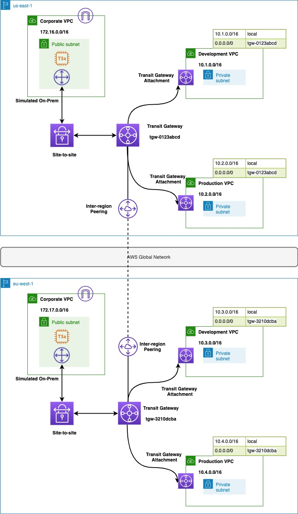
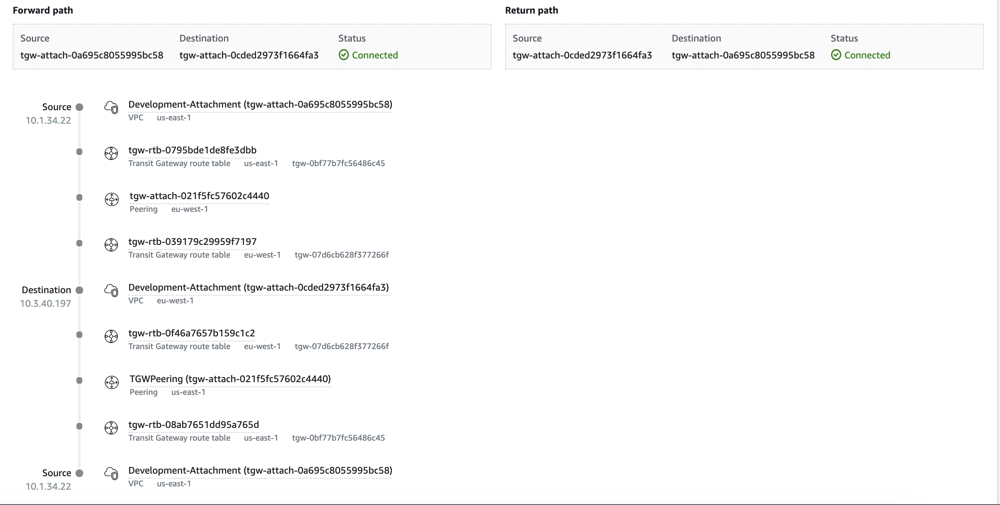

# Transit Gateway Inter-Region Peering using CDK

#### Table of Contents

* [Outcome](#Outcome)
* [What are we building?](#what-are-we-building)
* [What are the pre-requisites?](#what-are-the-pre-requisites)
* [How can I deploy the stack?](#how-can-i-deploy-the-stack)
* [How can I setup a site-to-site VPN?](#how-can-i-setup-a-site-to-site-vpn)
* [Let's cleanup](#lets-cleanup)
* [Security](#security)
* [License](#license)

## Outcome

We will build a global network with development, production and on-prem networks in `us-east-1`
and `eu-west-1`. The infrastructure will be built using a combination of CDK, AWS CLI and AWS
Console.

Below routes are allowed by this architecture

|     Source    |  Destination  |
|:-------------:|:-------------:|
| DevelopmentUS | DevelopmentEU |
| ProductionUS  | ProductionEU  |
| DevelopmentUS | CorpUS        |
| ProductionUS  | CorpUS        |
| DevelopmentEU | CorpEU        |
| ProductionEU  | CorpEU        |

**Note:** For the on-prem simulation, we will leverage the aws-samples

- https://github.com/aws-samples/vpn-gateway-strongwswan

## What are we building?



## What are the pre-requisites?

* Install the following
  ```shell
  brew install jq
  npm i -g -f aws-cdk@1.157.0
  ```
* You have configured AWS CLI using `aws configure`
* The role being used from CLI has the permissions required for resources being created by CDK
* The CDK params are stored [here](bin/data/params.json). Update them if needed.
* Let's build the code
  ```shell
  npm install
  npm run build
  npm run test
  ```

## How can I deploy the stack?

We build the below resources -

* On-prem CIDR for the site-to-site VPN setup
* EIP for the site-to-site VPN
* Transit Gateway
* Customer gateway
* Site-to-site VPN
* Development VPC
* Production VPC
* Development VPC routing
* Production VPC routing
* EC2 instance in Development and Production subnets
* VPC endpoints to access EC2 via SSM
* TransitGateway routing tables
* TransitGateway attachment
* TransitGateway association and propagation
* Global network for visualize the traffic using route analyzer

The script will build the stack in `us-east-1` and `eu-west-1`.
If you need to use different regions, please update the [deploy.sh](bin/scripts/deploy.sh)

**Note:** The transit gateway peering and acceptance is handled in the shell script

```shell
./bin/scripts/deploy.sh
```

## How can I setup a site-to-site VPN?

* Follow the steps provided here - https://github.com/aws-samples/vpn-gateway-strongwswan
* The previous stack has set up the below resources
    * Transit Gateway
    * Customer Gateway
    * Site-to-Site VPN
    * EIP
* Below commands will return the EIP allocationID and Transit Gateway ID
* This demo was tested with Pre-Shared Key-Based Authentication

```shell
export AWS_DEFAULT_REGION=us-east-1
aws cloudformation describe-stacks --stack-name TransitGatewayPeeringDemo --query 'Stacks[*].Outputs[?ExportName==`eipAllocationId`].OutputValue' --output text
aws cloudformation describe-stacks --stack-name TransitGatewayPeeringDemo --query 'Stacks[*].Outputs[?ExportName==`TransitGatewayId`].OutputValue' --output text

export AWS_DEFAULT_REGION=eu-west-1
aws cloudformation describe-stacks --stack-name TransitGatewayPeeringDemo --query 'Stacks[*].Outputs[?ExportName==`eipAllocationId`].OutputValue' --output text
aws cloudformation describe-stacks --stack-name TransitGatewayPeeringDemo --query 'Stacks[*].Outputs[?ExportName==`TransitGatewayId`].OutputValue' --output text

```

**Note:** You can verify the traffic flow using the Route Analyzer from Global Network



## Let's cleanup

```shell
./bin/scripts/destroy.sh
```

# Security

See [CONTRIBUTING](CONTRIBUTING.md#security-issue-notifications) for more information.

# License

This library is licensed under the MIT-0 License. See the [LICENSE](LICENSE) file.

